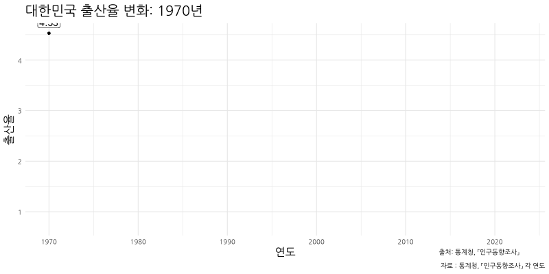
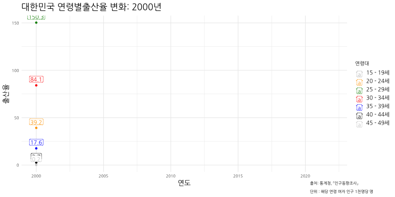
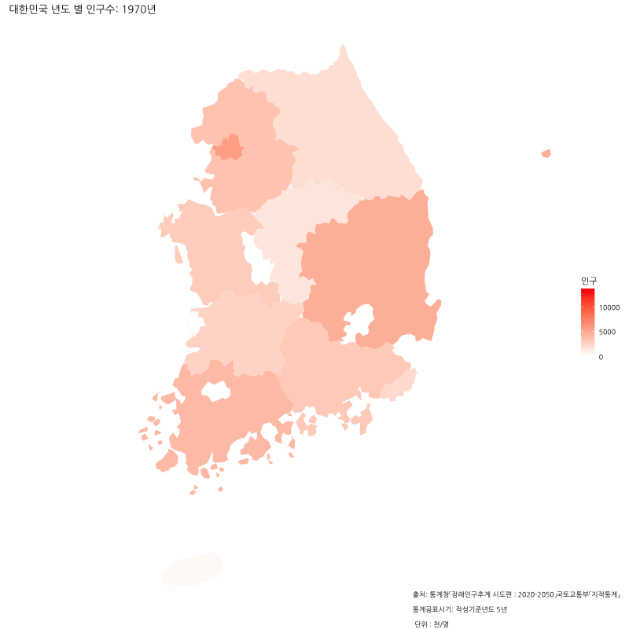
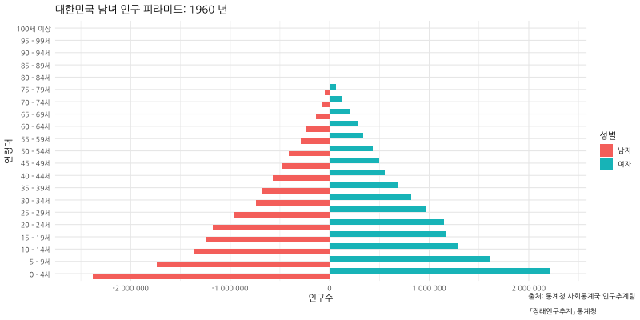

# 대한민국 인구동향 시각화 프로젝트

## 📊 프로젝트 개요
본 프로젝트는 대한민국의 인구 변화를 다각도로 분석하고 시각화한 것입니다. 출산율 변화부터 지역별 인구 분포, 연령별 인구 구조까지 다양한 측면에서 한국의 인구 동향을 탐구했습니다.

## 📈 주요 분석 내용

### 1. 출산율 분석
- 연도별 합계출산율 추이 분석
- 애니메이션을 통한 출산율 변화 시각화


### 2. 연령별 출산율
- 연령대별 출산율 변화 분석
- 시계열 데이터를 통한 연령별 출산 패턴 변화


### 3. 지역별 인구 분포
- 전국 시도별 인구 분포 현황
- 지도 시각화를 통한 지역별 인구 변화


### 4. 인구 피라미드
- 성별, 연령별 인구 구조 분석
- 시간에 따른 인구 구조 변화


## 📑 분석 자료
### 1. 상세 분석 보고서
전체 분석 내용을 담은 상세 보고서는 아래 링크에서 확인하실 수 있습니다:

📊 [대한민국 인구동향 종합 분석 보고서](output/reports/population_analysis.html)

### 2. 프로젝트 발표 영상
프로젝트의 상세한 설명과 분석 과정을 담은 발표 영상입니다:

🎥 [프로젝트 발표 영상 보기](https://drive.google.com/file/d/1234567890/view?usp=sharing)

> 💡 발표 영상에서 다루는 내용:
> - 프로젝트 배경 및 목적
> - 데이터 수집 및 분석 방법
> - 주요 발견점 설명
> - 시각화 결과 해석

## 🛠 사용 기술
- R 4.x.x
- 주요 패키지:
  - `ggplot2`: 데이터 시각화
  - `dplyr`: 데이터 전처리
  - `gganimate`: 애니메이션 시각화
  - `sf`: 지도 데이터 처리
  - `tidyverse`: 데이터 분석
  - `readxl`: 엑셀 파일 읽기
  - `cowplot`: 그래프 조합
  - `reshape2`: 데이터 구조 변환

## 📁 프로젝트 구조
```
korea-population-visualization/
├── data/                          # 데이터 파일
│   ├── raw/                      # 원본 데이터
│   │   ├── birth_rate/          # 출산율 데이터
│   │   ├── population/          # 인구 데이터
│   │   ├── world/              # 세계 인구 데이터
│   │   └── map/                # 지도 데이터
├── R/                            # R 스크립트
│   ├── 01_birth_rate.R         # 출산율 분석
│   ├── 02_age_birth_rate.R     # 연령별 출산율
│   ├── 03_regional_population.R # 지역별 인구
│   ├── 04_population_pyramid.R  # 인구 피라미드
│   └── 05_population_indicators.R # 인구 지표
├── output/                       # 결과물
│   ├── figures/                 # 시각화 결과
│   └── reports/                 # 분석 보고서
├── src/                         # 소스 코드
├── requirements.txt             # 패키지 의존성
└── README.md                    # 프로젝트 설명
```

## 📊 데이터 출처
- 통계청 「인구동향조사」 (2021-2023)
  - 출산율 및 인구동향 기초 데이터
- 통계청 「장래인구추계」 (2020-2050)
  - 연령별, 성별 인구구조 데이터
- 국토교통부 「지적통계」 (2023)
  - 지역별 인구밀도 관련 데이터

## 🔍 주요 발견점
1. 지속적인 출산율 감소 추세
   - 2021년 기준 합계출산율 0.81로 역대 최저 기록
   - 모든 연령대에서 출산율 감소 관찰
   
2. 수도권 인구 집중 현상
   - 서울, 경기 지역의 지속적인 인구 증가
   - 지방 도시의 인구 감소 가속화

3. 급격한 고령화
   - 65세 이상 인구 비율의 빠른 증가
   - 인구 피라미드의 역삼각형화
   - 생산가능인구 감소 추세

## 👥 제작자
- 박동균 (Donggyun Park)
- 데이터 시각화 프로젝트 (2024)

## 📝 라이선스
This project is licensed under the MIT License - see the LICENSE.md file for details

